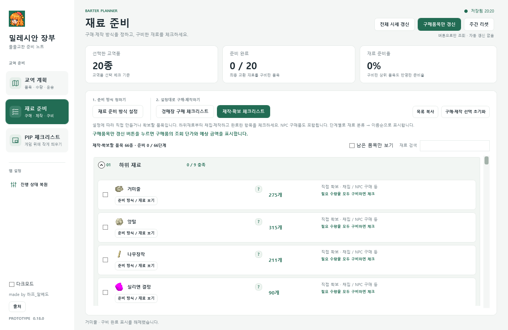
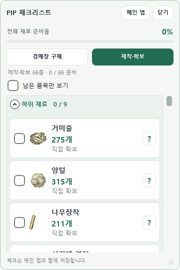

# 밀레시안 장부 · Milesian Ledger


이 개발 브랜치에는 **시장 통계와 공통 시세 다운로드**가 포함됩니다. 서버가 경매장을 수집·집계하고, 앱은 새 버전의 압축 파일만 내려받아 검색·정렬·교역 계산에 사용합니다. 정기 수집과 구버전 시세 경로 전환은 Worker 배포 변수로 제어합니다. 아래 공개 베타 링크와 개발 브랜치의 추가 기능은 구분하며, 구조·설정·검증 방법은 [시장 통계 안내](docs/MARKET_STATISTICS.md)에서 확인할 수 있습니다.

마비노기 물물교환 교역을 준비하는 Windows 데스크톱 앱입니다. 교역할 품목과 수량을 고르면 필요한 재료를 계산하고, **경매장 구매와 직접 제작·확보를 섞은 준비 계획**을 체크리스트로 관리합니다.


현재 버전은 **1.0.0-beta.2 · 공개 베타**입니다. WPF와 C#으로 구현한 Windows 데스크톱 앱이며, .NET Framework 4.8 런타임을 사용합니다.

**[공개 베타 실행 ZIP 다운로드](https://github.com/jang9610-cyber/MilesianLedger/releases/download/v1.0.0-beta.2/MilesianLedger-v1.0.0-beta.2.zip)** · [릴리스 페이지](https://github.com/jang9610-cyber/MilesianLedger/releases/tag/v1.0.0-beta.2) · [베타 릴리스 안내](docs/releases/v1.0.0-beta.2.md)

다운로드한 ZIP을 모두 압축 해제한 뒤 `MilesianLedger` 폴더의 `MilesianLedger.exe`를 실행하세요. GitHub의 자동 생성 **Source code (zip/tar.gz)**는 개발용 소스이며 실행 파일이 없습니다.

## 주요 기능

- **교역 계획**: 오아시스·카루 숲·페라 화산·칼리다 호수의 1~5티어 교역품 20종을 선택하고 목표 수량을 설정합니다. 선택한 품목은 교역소 카드와 상세 화면에서 강조됩니다.
- **혼합 준비 방식**: 최종 교환 재료와 하위 재료마다 경매장 구매·직접 제작·직접 확보를 선택합니다. 함께 쓰는 재료를 합산하고 제작 단위에 맞춰 필요한 수량을 계산합니다.
- **예상 비용 비교**: 모든 교환 재료를 완제품으로 살 때의 비용과, 내 준비 방식으로 드는 골드를 비교합니다. 교역 보너스·운송수단·파트너 설정에 따른 참고 판매액과 적재량도 확인할 수 있습니다.
- **두 가지 체크리스트**: 경매장에서 살 품목과 직접 제작·확보할 품목을 따로 보고 구비 완료를 체크합니다. 준비율에 즉시 반영되며, 남은 품목만 표시할 수 있습니다.
- **준비 순서와 재료 분류 정렬**: 하위 재료 → 중간 제작 단계 → 최종 교환 재료 순서로 묶고, 단계 안에서는 재료 분류 → 이름순으로 정렬합니다. 방직·실, 목공·장작, 제련·금속, 실리엔, 힐웬, 허브 등 관련 품목을 모아 볼 수 있습니다.
- **PIP 체크리스트**: 작은 항상 위 창에서 구매·제작 목록을 확인합니다. 체크 상태와 준비율은 메인 앱과 연동되고, 아이템의 `?`에서 획득 방법을 확인할 수 있습니다.
- **프리셋**: 기본 교역 계획 3종인 성실한 상인·체리피커·극한의 한탕과 사용자 교역 계획을 제공합니다. 재료 준비 방식은 별도로 1~5번 프리셋에 보관합니다.
- **수동 시세 갱신**: 모든 재료를 조회하는 **전체 시세 갱신**과 현재 계획의 구매품만 조회하는 **구매품목만 갱신**을 제공합니다. 진행 화면에서 갱신을 중지할 수 있습니다.
- **자동 저장과 복원**: 계획·준비 방식·구비 상태를 로컬에 저장하고, 진행 상태 복원과 주간 체크 초기화를 지원합니다.
- **아이템 안내와 화면 설정**: 아이템별 아이콘·획득 안내, 통합 출처 창, 다크 모드, 화면 전환 애니메이션을 제공합니다. 제작자 표기는 `made by 하프_알베도`입니다.

개발 브랜치의 **시장 통계**는 최근 24시간·7일 판매 수량·거래 건수·거래 금액·매물 수량을 제공합니다. **분류 필터**와 **판매 기회 모아보기**로 거래가 활발하거나, 판매량 대비 매물이 적거나, 최저 매물가가 최근 평균 거래가보다 낮은 품목을 살펴볼 수 있습니다. 별표로 저장한 **관심 품목**은 앱을 다시 실행해도 유지됩니다. 조건과 해석은 [시장 통계 안내](docs/MARKET_STATISTICS.md#품목-찾기와-관심-목록)에 설명되어 있습니다.

평균 거래가가 최저가의 **5배 이상**인 품목은 기본 통계 목록에서 제외하고 **제외된 위험군 보기**에서 따로 표시합니다. 제외 사유와 평균/최저가 배수를 확인할 수 있으며 원본 거래·관심 목록을 삭제하지 않습니다. 옵션이 있는 장비도 기록된 최저 매물가는 표시하고, 해당 가격의 옵션·분류 범위는 도움말로 안내합니다.

PIP는 고정된 **교역 / 경매장 검색** 탭으로 나뉘며, **교역** 안에 구매·제작 체크리스트와 준비율을 모아 표시합니다. **경매장 검색**에서는 교역 재료 외의 드랍 아이템도 이름으로 찾아 수집 시점의 개당 최저가와 매물 수량을 확인합니다. PIP·시장 통계·분배 화면에서 초성 검색(`ㄱㅁㅈ` → 거미줄), 이름·초성 혼합 검색(`가는 ㅅㅁㅊ` → 가는 실뭉치), 띄어쓰기 생략을 지원합니다. PIP와 분배 검색은 기존 이름 일치 결과를 먼저 보여 주며, 통계는 선택한 지표 정렬을 유지합니다. 새 시장 품목의 이미지는 대체 아이콘을 사용합니다. 서버가 게시한 완료본을 내려받은 뒤 검색·정렬·분류·관심 목록 조작은 로컬에서 처리합니다. 일별 추이 그래프·제작 수익 분석은 포함하지 않습니다.

**수수료·분배**에서는 직접 입력한 실제 판매 금액으로 기본·프리미엄 수수료와 할인 쿠폰 5종의 비용을 비교하고, 1인당 분배금과 잔액을 계산합니다. 아이템 검색의 최저 매물가·24시간/7일 평균 판매단가는 참고용으로만 표시합니다. 쿠폰 비용은 시세 또는 수동 입력을 사용하며, 선택한 분배 방식과 비교표를 이미지로 복사할 수 있습니다. 계산식과 범위는 [사용 안내](docs/USER_GUIDE.md)에 설명되어 있습니다.

인챈트 스크롤은 **시세 갱신** 후 `템포`처럼 인챈트 이름으로 검색할 수 있습니다. `템포 (접미 / 랭크 6) · 전용 인챈트 스크롤`처럼 표시하며 일반·전용·개방된 전용 스크롤의 시세를 구분합니다. 이름이 확인되지 않은 스크롤의 혼합 최저가는 표시하지 않으며, 장비에 부착된 인챈트는 검색에 사용하지 않습니다. 이름별 과거 거래는 새로 수집한 기록부터 쌓입니다.

## 화면 예시

재료 준비 목록과 PIP 체크리스트 화면입니다.





## 처음 사용하기

1. 위의 **공개 베타 실행 ZIP**을 내려받아 모두 압축 해제한 뒤 `MilesianLedger/MilesianLedger.exe`를 실행합니다. 실행 파일과 `data`, `assets` 폴더를 함께 보관하세요.
2. 시작 안내에서 그랜드마스터 상인 전환 여부를 확인한 뒤 메인 화면으로 들어갑니다. 이 안내는 게임 내 재능을 직접 변경하지 않습니다.
3. **교역 계획**에서 교역품과 수량을 선택합니다. 교역 보너스·운송 설정을 조정하거나 프리셋으로 시작할 수 있습니다.
4. **재료 준비 → 재료 준비 방식 설정**에서 어떤 재료를 구매하고 어떤 재료를 직접 준비할지 정합니다. 바꾼 준비 방식은 현재 사용 중인 번호 프리셋에 자동 저장됩니다.
5. 원하는 **시세 갱신 버튼**을 누릅니다. 배포본에는 Cloudflare 시세 서버 주소가 설정되어 있으며, 사용자가 API 키를 발급하거나 입력할 필요는 없습니다.
6. **경매장 구매 체크리스트**와 **제작·확보 체크리스트**를 따라 하위 재료부터 준비합니다. 해당 수량을 모두 구비하거나 제작을 마친 뒤 체크하세요. PIP에서도 같은 체크리스트를 사용할 수 있습니다.

교역 계획 화면의 재료 목록은 필요 재료 안내용입니다. 준비 방식은 **재료 준비**에서 변경하고, 구비 완료 체크는 **재료 준비**와 **PIP 체크리스트**에서 진행합니다. 최종 교환 재료를 모두 구비하면 재료 준비율도 100%가 됩니다.

기존 버전에서 업데이트할 때는 앱을 닫고 실행 폴더를 백업한 다음 새 ZIP을 별도 폴더에 풉니다. 기존 `data`의 개인 진행·설정 파일만 새 폴더로 복사하면 계획과 체크 상태를 이어 쓸 수 있습니다. 복사할 파일과 자세한 절차는 [사용 안내의 설치·업데이트](docs/USER_GUIDE.md#설치와-업데이트)를 참고하세요.

## 시세 서버와 가격 표시

개발 브랜치의 시세는 **서버 정기 수집 → 공통 집계·압축 → 앱 다운로드** 흐름입니다. 넥슨 API 키는 Cloudflare Secret `NEXON_API_KEY`에만 설정하며 앱·배포 ZIP·공개 저장소에 넣지 않습니다. 앱에는 API 키 입력·저장 메뉴가 없습니다.

**배포본에는 시세 서버 주소가 포함되어 있습니다.** 별도 서버 설정 없이 갱신 버튼으로 조회할 수 있습니다. 서버 수집이나 다운로드가 중단돼도 계획·체크리스트·이전에 검증한 데이터는 유지합니다. 아직 완료된 공통 게시본이 없으면 준비 중으로 안내하며, 이를 사용자별 넥슨 조회로 대체하지 않습니다.

공개 접속 주소는 `https://restless-bread-9002milesianledger-api.jang9610.workers.dev`입니다. 앱은 넥슨으로 직접 연결하지 않습니다.

운영자가 서버 주소를 변경할 때는 `data/auction-proxy.json`의 `BaseUrl`을 수정하고 빌드합니다. HTTPS를 사용하며 로컬 개발용 HTTP는 루프백 주소만 허용합니다. 이 주소는 공개 접속 주소이며 비밀 키가 아닙니다. 운영 방법은 [Cloudflare 서버 안내](server/cloudflare/README.md), 구조와 연결 절차는 [프록시 설계](docs/PROXY_ARCHITECTURE.md)를 참고하세요. [Node.js 서버](server/README.md)는 자체 호스팅을 위한 참고 구현입니다.

교역 시세는 **전체 시세 갱신** 또는 **구매품목만 갱신**을 눌렀을 때 공통 버전 manifest를 확인합니다. 같은 버전이면 재다운로드하지 않고, 새 버전이면 gzip 파일 하나의 크기·SHA-256·내용을 검증한 뒤 대상 재료에 반영합니다. 품목 수만큼 넥슨을 호출하지 않습니다. 앱 실행·체크·수량 변경·프리셋 선택으로 교역 시세를 자동 갱신하지 않습니다.

시장 통계와 수수료·분배는 메인 앱 안에서 전환하는 화면입니다. 페이지를 열 때는 저장된 시세를 읽고, **통계 갱신** 또는 **시세 갱신** 버튼을 눌렀을 때 공통 데이터를 내려받습니다. PIP 경매장 검색은 **시세 받기·갱신** 버튼으로만 다운로드를 시작합니다. 검색·기간·정렬·페이지 변경은 로컬에서 처리합니다. 공통 데이터는 앱 폴더의 `data/market-snapshots/`에 서버별로 저장하고, 손상되거나 다운로드에 실패한 새 파일이 이전 검증본을 덮어쓰지 않게 합니다. 버전이 바뀐 경우에는 전체 압축 집계본을 받으며 바이트 단위 차분 파일을 적용하는 방식은 아닙니다.

기존 공개 베타는 품목별 조회 경로를 사용합니다. Worker에서 `SHARED_MARKET_QUOTES_ENABLED=true`로 전환하면 이 경로도 완료한 공통 게시본을 읽고 추가 넥슨 요청을 하지 않습니다. 전환 전의 기존 프록시 동작과 새 앱의 공통 다운로드 동작은 구분합니다. [서버 운영 변수](server/cloudflare/README.md#운영-변수)를 참고하세요.

가격은 최근 완료한 매물 수집본의 최저 개당 가격입니다. 다운로드 시각으로 원래 수집 시각을 바꾸지 않습니다. 필요한 수량 전부를 그 가격에 살 수 있다는 뜻은 아니며, 수집 중 매물 변동과 API 반영 지연에 따라 실제 구매액은 달라질 수 있습니다. 부분 수집·오류가 이전 정상 시세를 대체하지 않으며, 매물 없음·미확인·오래된 데이터는 구분합니다. 통계의 24시간·7일 범위는 표시된 공통 게시 시각을 기준으로 합니다.

서버는 거래 내역 20분, 매물 기본 60분 간격의 수집 구조를 갖추고 있습니다. 실제 운영 간격과 활성화는 전체 조회량을 확인한 뒤 배포 설정으로 정합니다. 무료 플랜의 읽기·쓰기·저장·요청 한도와 넥슨 공용 예산을 따르며, 사용자 수가 늘어도 넥슨 수집 횟수를 그대로 유지하는 대신 공통 파일 다운로드 요청은 늘어납니다. [구조와 무료 플랜 운영 기준](docs/MARKET_STATISTICS.md#무료-플랜의-예산)을 참고하세요.

Data based on NEXON Open API.

## 계산 범위와 참고 사항

- **나무판과 500 포션류**는 완제품 경매장 구매로 고정합니다.
- **새우·설탕·마늘**은 NPC 구매로 표시하고 경매장 조회 및 비용 합계에서 제외합니다. 새우 조련 미끼 완제품의 구매 여부는 선택할 수 있습니다.
- 직접 확보하는 재료는 경매장 구매 비용에 넣지 않습니다. 표시 금액은 준비 계획의 예상 비용이며 실제 지출 기록이나 게임 인벤토리 조회 결과가 아닙니다.
- 제작 수량은 성공한 제작을 기준으로 계산합니다. 제작 실패로 인한 추가 소모, 보증서 구매비 등 부대비용은 포함하지 않습니다.
- 판매액은 저장된 참고 평균가, 운송 횟수는 적재 칸·무게를 기준으로 한 예상입니다. 실제 경로·게임 상황을 모두 반영하지 않습니다. 교역품과 제작 데이터는 게임에서 자동 동기화하지 않습니다.
- 구비 체크는 해당 항목의 **필요 수량 전체를 준비했다는 표시**입니다. 부분 보유 수량을 기록하는 재고 관리 기능은 제공하지 않습니다.
- PIP는 별도의 Windows 창입니다. 게임 환경에 따라 PIP 조작 후 클릭 상태가 게임에 남을 수 있습니다. 앱은 게임 메모리 접근·입력 자동화·게임 조작을 수행하지 않습니다.

## 개발 환경과 빌드

Windows와 Windows PowerShell을 사용합니다. **.NET Framework 4.8을 권장**하며, 빌드 스크립트는 Windows의 .NET Framework C# 컴파일러(`v4.0.30319\csc.exe`)와 WPF 어셈블리를 사용합니다. .NET SDK와 별도의 NuGet 패키지는 기본 빌드에 필요하지 않습니다.

저장소 루트에서 다음 명령을 실행합니다.

```powershell
powershell -NoProfile -ExecutionPolicy Bypass -File .\build.ps1
```

실행 파일은 `dist\MilesianLedger\MilesianLedger.exe`에 생성됩니다.

```powershell
# 오프라인 계산·경매장 검증
powershell -NoProfile -ExecutionPolicy Bypass -File .\scripts\test.ps1

# 메인·PIP 화면 검증까지 포함 (대화형 Windows 데스크톱 필요)
powershell -NoProfile -ExecutionPolicy Bypass -File .\scripts\test.ps1 -IncludeUi

# Cloudflare Worker·SQLite·공통 게시본 오프라인 검증 (Node.js 24 권장)
node --test "server/cloudflare/*.test.mjs"

# 공통 다운로드·로컬 재사용과 시장 화면 검증
powershell -NoProfile -ExecutionPolicy Bypass -File .\scripts\test-market-snapshot.ps1
powershell -NoProfile -ExecutionPolicy Bypass -File .\scripts\test-market-ui.ps1
powershell -NoProfile -ExecutionPolicy Bypass -File .\scripts\test-market-insights.ps1

# 앱 내 페이지 전환·정산 입력 유지·기본 및 최소 창 크기 검증
powershell -NoProfile -ExecutionPolicy Bypass -File .\scripts\test-workspace-ui.ps1
powershell -NoProfile -ExecutionPolicy Bypass -File .\scripts\test-auction-settlement-ui.ps1

# Node.js 참고 구현의 오프라인 검증
powershell -NoProfile -ExecutionPolicy Bypass -File .\scripts\test-server.ps1

# 배포용 ZIP 생성
powershell -NoProfile -ExecutionPolicy Bypass -File .\scripts\package.ps1
```

검증은 테스트용 데이터와 가짜 경매장 응답을 사용하며 실제 API 키나 실제 경매장 호출이 필요하지 않습니다. 서버 검증도 모의 응답만 사용합니다. WPF 화면을 다루는 검증에는 대화형 Windows 데스크톱이 필요합니다. 게임과의 PIP 입력 호환성은 별도로 확인해야 합니다.

같은 버전의 ZIP을 다시 만들 때는 `package.ps1 -Force`를 사용합니다. ZIP 옆에 SHA-256 검증 파일도 생성됩니다.

배포할 때는 생성된 `dist\MilesianLedger-v1.0.0-beta.2.zip`을 사용하세요. 사용 중인 실행 폴더를 그대로 압축하면 개인 진행 상태가 섞일 수 있으므로 배포 스크립트로 묶는 것을 권장합니다.

## 저장소 구조

```text
MilesianLedger/
├─ README.md
├─ build.ps1                 # 루트 빌드 진입점
├─ .gitignore
├─ .gitattributes
├─ src/                      # WPF 화면, 계산, 저장, 경매장 연동
├─ tests/                    # 계산·저장·화면·경매장 오프라인 검증
├─ scripts/
│  ├─ build.ps1
│  ├─ package.ps1
│  ├─ test.ps1
│  ├─ test-server.ps1
│  └─ update-proxy-items.ps1
├─ server/
│  ├─ cloudflare/            # 현재 시세 서버: Worker·Durable Object·배포/검증 도구
│  ├─ src/                   # 자체 호스팅용 Node.js 참고 구현
│  ├─ test/                  # Node.js 참고 구현의 오프라인 검증
│  └─ item-names.json        # 앱 카탈로그에서 생성하는 허용 품목
├─ data/                     # 교역·제작·획득 데이터와 공개 시세 서버 주소
├─ assets/
│  ├─ app-icon/
│  ├─ loading-wagon-animation/frames/
│  └─ item-icons/
├─ docs/
│  ├─ USER_GUIDE.md
│  ├─ PROXY_ARCHITECTURE.md
│  ├─ DEVELOPMENT.md
│  └─ releases/              # 버전별 공개 릴리스 안내
└─ dist/                     # 실행 빌드와 배포 ZIP · Git 제외
```

계산과 저장의 중심은 `src/BarterCore.cs`, `src/ProcurementCore.cs`, `src/ProcurementReadiness.cs`이며, 경매장 연동은 `src/AuctionCore.cs`와 `src/AuctionProxyConfig.cs`, 공통 다운로드는 `src/MarketSnapshot.cs`, 시장 화면은 `src/MarketUi.cs`, 분류 정렬은 `src/ItemCategories.cs`에서 관리합니다. 정적 JSON과 로컬 아이콘은 실행 파일과 함께 배포됩니다. 시장 Worker의 배포에는 `server/cloudflare/wrangler.market.jsonc`를 사용하며 이전 교역 전용 설정과 번갈아 배포하지 않습니다.

## 브랜치 운영

| 브랜치 | 용도 |
| --- | --- |
| `main` | 검증을 마친 배포 기준 소스 |
| `develop` | 다음 버전을 위한 기능 추가와 수정 통합 |

평소 개발은 `develop`을 기준으로 진행합니다. 여러 파일에 걸치는 기능이나 수정은 작업별 브랜치로 분리하고, 완료 후 `develop`에 병합합니다. 배포 전 검증을 마친 변경만 `main`에 반영합니다. 공개 베타는 `v1.0.0-beta.2`과 같은 태그에 연결한 GitHub Pre-release로 배포합니다. 자세한 기준은 [개발 브랜치 안내](docs/DEVELOPMENT.md)를 참고하세요.

## 개인 파일과 Git 업로드

이 저장소는 **소스·정적 데이터·앱 에셋·문서·검증 코드**를 관리합니다. `dist/`와 빌드 결과물, 사용자 진행 상태, 개인 설정·과거 키 파일·가격 캐시, 서버 `.env`·호출량 기록, 개인 화면 설정과 백업은 `.gitignore`로 제외합니다. 실행 빌드와 ZIP은 Git 저장소에 직접 커밋하기보다 GitHub Releases 같은 별도 배포 항목에 ZIP으로 첨부할 수 있습니다.

실행 중 사용하는 개인 파일에는 `data/progress.json`, `data/progress-history.json`, `data/auction-settings.json`, `data/auction-cache.json`, `data/pip-settings.json`, `data/appearance.txt` 등이 있습니다. 기존 버전의 `auction-key.dat`는 더 이상 읽거나 만들지 않으며, 업그레이드 시 자동 삭제하지 않습니다. `auction-settings.json`은 품목명 매핑과 조회 제한 같은 기존 설정을 유지하는 데 사용합니다.

`data/auction-proxy.json`은 공개 주소만 담는 배포 설정이라 Git에 포함합니다. 실제 넥슨 키는 Cloudflare Secret으로 관리합니다. `server/cloudflare/.dev.vars.example`과 `server/.env.example`은 빈 설정 예시이며, 실제 `.dev.vars`·`.env`, `node_modules/`·`.wrangler/`·`.dry-run/`, Node 참고 구현의 `server/.runtime/`은 Git에서 제외합니다. Worker 소스와 배포 설정은 Git에 포함하지만 데스크톱 앱 ZIP에는 포함하지 않습니다.

커밋 전에는 `git status`로 추가할 파일을 확인하세요. `.gitignore`는 이미 Git에 등록한 파일을 자동으로 삭제하지 않습니다.

## 출처와 권리

교역·제작 정보와 이미지의 출처는 앱의 **출처** 창, `data/`의 출처 필드, `assets/item-icons/manifest.json`에서 확인할 수 있습니다.

- 아이템·획득 정보 및 이미지 참고: [라바뉴의 마비노기](https://mabi.labanyu.com/)
- 교역 판매·운송 정보 참고: [마비 교역 도우미](https://mabitrade.kro.kr/main)
- 경매장 데이터: [NEXON Open API](https://openapi.nexon.com/ko/game/mabinogi/?id=33)
- 경매장 분류 순서·계층 참고: [mabi.zip 경매장](https://mabi.zip/auction-live)

이 앱은 개인 제작 보조 도구이며 NEXON의 공식 프로그램이 아닙니다. 마비노기 관련 명칭·캐릭터·게임 이미지 등 제3자 자료의 권리는 각 권리자에게 있습니다. 생성형 이미지로 제작한 앱 아이콘과 로딩 이미지도 게임 캐릭터를 참고한 에셋입니다.

현재 별도의 오픈소스 라이선스는 지정하지 않았습니다. 저장소에 포함되어 있다는 사실만으로 소스와 모든 에셋에 동일한 재배포·상업 이용 권한이 부여되는 것은 아닙니다. 공개·재배포 시에는 소스의 라이선스와 제3자 자료의 이용 조건을 각각 확인해야 합니다.

made by 하프_알베도
