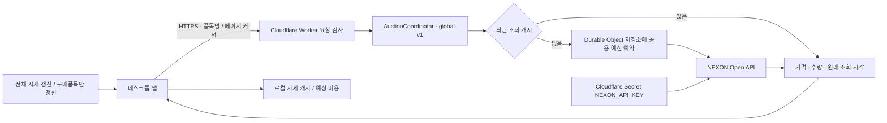

# 시세 프록시 구조

밀레시안 장부는 공개 Cloudflare Worker를 통해 경매장 시세를 조회합니다. 앱은 전체 시세 또는 구매품목 갱신 버튼으로만 시세를 요청합니다. 넥슨 키는 Cloudflare Secret `NEXON_API_KEY`에 보관하고, 앱에는 키 입력·저장·삭제 화면을 제공하지 않습니다.



## 구성과 책임

| 위치 | 역할 | 배포·공개 범위 |
| --- | --- | --- |
| `src/AuctionProxyConfig.cs` | 공개 서버 주소 확인 | 앱 포함 |
| `src/AuctionCore.cs` | 버튼 요청·페이지 조회·중지·로컬 시세 캐시 | 앱 포함 |
| `data/auction-proxy.json` | 공개 접속 주소 `BaseUrl` | Git·앱 포함 |
| `server/cloudflare/worker.mjs` | 현재 운영 Worker와 `AuctionCoordinator` | Git 포함, Cloudflare에서 실행 |
| `server/cloudflare/wrangler.jsonc` | Worker 이름·일반 변수·Durable Object 연결과 SQLite 저장소 등록 | Git 포함, 비밀 값 제외 |
| `server/item-names.json` | 앱 카탈로그에서 생성하는 경매장 품목 허용 목록 | Git 포함 |
| Cloudflare Secret `NEXON_API_KEY` | 넥슨 인증 | Cloudflare 비밀 설정으로만 등록 |
| Durable Object 저장소 | 최근 24시간 호출 예약 기록 | Cloudflare에서 보관, 앱·Git 제외 |
| `server/src/`, `server/test/` | 자체 호스팅용 Node.js 참고 구현과 검증 | Git 포함, 별도 선택 사항 |

앱 빌드에는 Node.js나 Cloudflare 계정이 필요하지 않습니다. 데스크톱 배포 ZIP에는 공개 서버 주소만 포함하며 Worker·Node 서버 코드와 서버 환경 파일은 넣지 않습니다. 서버 운영 절차는 [Cloudflare 안내](../server/cloudflare/README.md), Node 참고 서버의 파일 저장소·프로세스 잠금·IP별 제한은 [참고 구현 안내](../server/README.md)를 따릅니다.

## 현재 접속 주소

```json
{
  "BaseUrl": "https://restless-bread-9002milesianledger-api.jang9610.workers.dev"
}
```

이 주소는 공개 접속 주소이며 인증 비밀이 아닙니다. `BaseUrl` 뒤에 `/auction`이나 `/v1/auction/list`를 붙이지 않습니다. 앱이 요청 경로를 추가합니다. 주소를 바꾸면 앱을 다시 실행해야 반영됩니다.

앱은 HTTPS를 사용합니다. 로컬 개발은 `http://127.0.0.1:8787` 같은 루프백 HTTP만 허용합니다. 주소에 사용자 인증 정보·쿼리·URL 조각을 넣거나 넥슨 도메인을 직접 지정할 수 없습니다. 별도 운영자가 접두 경로를 사용할 경우 서버에서도 해당 경로를 처리해야 합니다. 현재 Worker는 루트의 `/v1/auction/list`와 호환 경로 `/auction`을 지원합니다.

## 앱과 서버의 요청 규약

```http
GET /v1/auction/list?item_name=<URL 인코딩한 정확한 아이템 이름>&cursor=<페이지 커서>
Accept: application/json
```

첫 페이지는 `cursor`를 생략하거나 빈 문자열로 보냅니다. 앱은 키·쿠키·사용자 계정을 전송하지 않습니다. 서버는 품목명과 커서 외의 쿼리를 거부하고, 허용 목록의 품목만 고정된 넥슨 경매장 주소로 조회합니다. 서버가 받은 임의의 URL이나 인증 헤더를 넥슨에 전달하지 않습니다.

성공 응답의 가격·수량 예시는 가상 값입니다.

```json
{
  "auction_item": [
    { "item_name": "가는 실뭉치", "auction_price_per_unit": 100, "item_count": 20 }
  ],
  "next_cursor": null,
  "fetched_at": "2026-09-11T00:00:00.000Z"
}
```

`fetched_at`은 서버가 넥슨 응답을 받은 UTC 시각입니다. 캐시 응답도 이 값을 바꾸지 않으며, 여러 페이지를 합친 가격에는 가장 오래된 페이지의 조회 시각을 사용합니다. 넥슨 내부 데이터의 갱신 시각을 뜻하지는 않습니다. 빈 목록은 매물 없음이며 실패 응답과 구분합니다. 판매자 등 불필요한 상세 필드는 앱에 전달하지 않습니다.

실패 응답은 `{ "error": { "code": "PROXY_NOT_CONFIGURED", "message": "…" } }` 형태입니다. 앱은 알려진 `code`와 HTTP 상태를 로컬 안내 문구로 바꾸며 서버의 자유 형식 메시지·응답 원문을 사용자 데이터에 저장하지 않습니다.

| 상황 | 예시 코드 | 앱 동작 |
| --- | --- | --- |
| 조회 비활성·키 또는 binding 미설정 | `PROXY_NOT_CONFIGURED` | 갱신 중단, 연결 준비 안내 |
| 요청 집중 | `PROXY_BUSY` | 중단 후 나중에 버튼으로 재시도 안내 |
| 공용 예산 소진 | `PROXY_QUOTA_EXCEEDED` | 중단 후 한도 안내 |
| 넥슨 인증·한도 문제 | `PROXY_UPSTREAM_AUTH`, `PROXY_UPSTREAM_LIMIT` | 중단, 운영 확인 또는 한도 안내 |
| 잘못된 품목 | `PROXY_ITEM_NOT_ALLOWED` | 해당 품목 실패 표시 |
| 응답 지연·형식 오류 | `PROXY_TIMEOUT`, `PROXY_INVALID_RESPONSE` | 중단, 기존 조회값 유지 |
| 예산 저장소 오류 | `PROXY_QUOTA_UNAVAILABLE` | 중단, 기존 조회값 유지 |

자동 재시도나 주기적 시세 수집은 없습니다. `GET /health`는 Worker 기동 상태만 확인하고 넥슨을 호출하지 않습니다. 정상 `/health` 응답만으로 넥슨 키의 인증이나 잔여 한도를 확인할 수는 없습니다.

## 호출량과 캐시

- **앱**: 버튼 조작에만 실행하며 갱신당 최대 500요청, 기본 품목당 최대 10페이지입니다. 대상 조회가 끝나면 종료합니다. 전체 시세는 지원하는 전체 재료, 구매품목은 현재 계획의 구매 목록을 조회하며 NPC 구매품은 제외합니다.
- **공통 객체**: 모든 Worker 요청은 `AUCTION_COORDINATOR` binding의 `AuctionCoordinator` 클래스, 이름 `global-v1`인 동일 객체로 모입니다. 사용자나 지역별로 500회씩 별도 예산을 부여하지 않습니다.
- **캐시**: 같은 품목·커서의 성공 응답을 60초간 재사용합니다. 동시에 들어온 같은 요청도 앞선 성공 결과를 재사용합니다. 메모리 캐시는 객체가 다시 시작되면 사라질 수 있으며, 캐시 적중은 넥슨 호출 예산을 쓰지 않습니다.
- **공용 예산**: 최근 24시간의 호출 예약을 Durable Object 저장소에 먼저 기록한 뒤 넥슨을 요청합니다. 저장 실패 시 조회하지 않으며, 실패한 실제 요청도 예산에 포함합니다. 저장된 예산은 객체 재시작 후에도 이어집니다.
- **속도와 처리량**: 넥슨 요청을 직렬화하고 기본 초당 최대 5회로 제한합니다. 대기열·대기 시간·응답 크기를 제한하며 인증·한도 오류를 자동 재시도하지 않습니다.

서버의 `UPSTREAM_REQUESTS_PER_24H` 기본값 500은 프로젝트의 공용 운영 예산입니다. 넥슨이 실제 키에 부여한 한도 또는 앱 한 번의 갱신 상한과는 별개입니다. 같은 키를 다른 서비스에서 사용하면 그 호출량을 이 서버가 알 수 없으며, 넥슨의 실제 한도에 먼저 도달할 수 있습니다.

Worker는 Node 참고 구현의 파일 잠금이나 소켓 주소별 분당 600회 제한을 사용하지 않습니다. 공개 주소 자체는 사용자 인증을 제공하지 않으므로 운영 규모에 맞는 이용자별 제한은 Cloudflare 앞단에서 별도로 구성해야 합니다. 앱에는 공통 비밀 문자열을 내장하지 않습니다.

앱에서 갱신을 중지하면 추가 페이지 요청을 멈춥니다. 이미 Worker에 전달된 요청이 즉시 취소되는지는 연결 처리에 따라 달라질 수 있습니다.

## 운영 설정 변경

1. Cloudflare Secret `NEXON_API_KEY`에서 키를 관리합니다. 저장소 파일이나 앱에 키를 넣지 않습니다.
2. `AUCTION_ENABLED`가 문자열 `true`일 때만 넥슨 조회를 허용합니다. 현재 공개 배포 설정은 `true`입니다. 중단할 때는 `false`로 바꾸며 대시보드와 로컬 `wrangler.jsonc`를 함께 맞춰 이후 배포가 설정을 되돌리지 않게 합니다.
3. 실제 발급 한도와 같은 키의 다른 사용처를 고려해 공용 예산을 설정합니다. 운영 키로 바꾸더라도 공개 주소가 같으면 앱을 다시 배포할 필요는 없습니다.
4. 서버 코드와 binding을 변경할 때는 [Cloudflare 배포 절차](../server/cloudflare/README.md)를 따릅니다. `/health` 확인과 실제 시세 확인을 구분하고, 시세 확인은 실제 예산을 사용할 수 있는 수동 요청으로 수행합니다.

별도 배포본에서 서버 주소를 설정하지 않으면 HTTP 요청이나 키 입력창을 띄우지 않습니다. 기존 계획·프리셋·체크 상태·시세 캐시는 보존하며 과거 `auction-key.dat`는 읽거나 갱신하지 않습니다.

## 검증과 품목 데이터 관리

저장소 루트에서 실행합니다.

```powershell
# 앱 계산·전송 규약·주요 화면 검증 (실제 API 호출 없음)
powershell -NoProfile -ExecutionPolicy Bypass -File .\scripts\test.ps1 -IncludeUi

# 현재 Cloudflare Worker의 오프라인 검증 (Node.js 22 이상)
powershell -NoProfile -ExecutionPolicy Bypass -File .\server\cloudflare\worker-tools.ps1 test

# Node.js 참고 구현의 오프라인 검증
powershell -NoProfile -ExecutionPolicy Bypass -File .\scripts\test-server.ps1

# 앱 카탈로그에서 Node 목록과 Worker 내장 허용 품목을 함께 갱신
powershell -NoProfile -ExecutionPolicy Bypass -File .\scripts\update-proxy-items.ps1

# 두 서버의 허용 품목이 앱 카탈로그와 일치하는지 확인
powershell -NoProfile -ExecutionPolicy Bypass -File .\scripts\update-proxy-items.ps1 -Check
```

Worker는 경매장 품목 117종을 `worker.mjs`의 `ITEM_NAMES`에 포함합니다. 품목명·제작법을 바꾸면 허용 목록도 함께 갱신한 후 Worker를 배포해야 실제 서버에 반영됩니다. 개인 이름 매핑으로 다른 이름을 사용한다면 서버에도 해당 정확한 경매장 이름이 등록되어 있어야 합니다.

오프라인 검증은 가짜 경매장 응답과 테스트용 저장소를 사용하며 실제 API를 호출하지 않습니다. 앱 화면 검증에는 대화형 Windows 데스크톱이 필요합니다.
